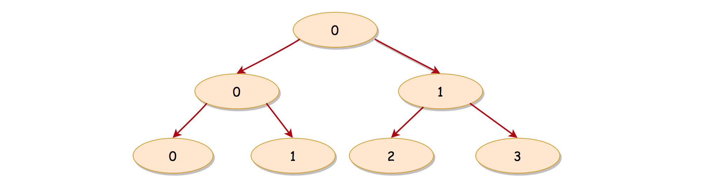

# 🟠 236 - Lowest Common Ancestor of a Binary Tree

<details>

<summary>Description 题目描述 </summary>

Given a binary tree, <mark style="color:yellow;">**find the lowest common ancestor**</mark> (LCA) of two given nodes in the tree. According to the [definition of LCA on Wikipedia](https://en.wikipedia.org/wiki/Lowest\_common\_ancestor): “The lowest common ancestor is defined between two nodes `p` and `q` as the lowest node in `T` that has both `p` and `q` as descendants (where we <mark style="color:yellow;">**allow a node to be a descendant of itself**</mark>).”

.png>)

<pre class="language-java"><code class="lang-java"><strong>Input: root = [3,5,1,6,2,0,8,null,null,7,4], p = 5, q = 1
</strong><strong>Output: 3
</strong><strong>LCA of nodes 5 and 1 is 3.
</strong></code></pre>



<pre class="language-java"><code class="lang-java"><strong>Input: root = [3,5,1,6,2,0,8,null,null,7,4], p = 5, q = 4
</strong><strong>Output: 5
</strong><strong>LCA of nodes 5 and 4 is 5, 
</strong><strong>since a node can be a descendant of itself according to the LCA definition.
</strong></code></pre>

**Constraints:**

* The number of nodes in the tree is in the range <mark style="color:red;">**`[2, 105`**</mark>`]`.
* <mark style="color:red;">**-109 <=**</mark> Node.val <= 109
* All Node.val are <mark style="color:red;">**unique**</mark>.
* `p != q`
* `p` and `q` will <mark style="color:red;">**exist in the tree.   => 和2的区别**</mark>

</details>

<details>

<summary>解题思路 Intuition </summary>

透过问题看本质，这道题其实就是在看如何在二叉树中找到两个节点的最低公共祖先。这个问题的核心是理解什么是最低公共祖先，以及如何在树结构中进行有效的搜索。

1. **理解最低公共祖先（LCA）**：最低公共祖先表示在树中，两个节点 `p` 和 `q` 共享的祖先节点，且该祖先节点是最接近 `p` 和 `q` 的。也就是说，如果我们从 `p` 和 `q` 向上追溯，LCA 是第一个同时被 `p` 和 `q` 访问到的节点。
2. **二叉树的搜索**：由于我们处理的是树结构，因此递归是一种自然的解决方案。我们需要从根节点开始，然后递归地在左右子树中搜索 `p` 和 `q`。递归的基础情况是找到 `p`、`q` 或达到叶子节点。
3. **返回结果的处理**：递归搜索的结果可以告诉我们 `p` 和 `q` 在不在当前子树中，以及他们的 LCA 是什么。因此，我们需要根据左右子树的搜索结果来确定当前节点的返回值，这一点在代码中以 `if-else` 语句实现。

**注意题目constraint:**&#x20;

1. p和q肯定存在于tree
2. 每个node.val是unique的

</details>

<details>

<summary>Algorithm </summary>

这是一个递归算法，用于在二叉树中找到两个给定节点的最低公共祖先（LCA）。

1. 我们首先检查root节点。如果root是 `null`（也就是说，我们已经到达了树的底部而没有找到 `p` 或 `q`），我们返回 `null`。
2. 如果root等于 `p` 或 `q`，则根据题目，root 必定是 `p` 或 `q` 的最低公共祖先，因为 `p` 和 `q` 一定在树中，所以我们返回根节点。
3.  如果root不是 `p` 或 `q`，我们则在左右子树中寻找 `p` 和 `q`。我们对左子树和右子树进行递归调用，以找到 `p` 和 `q`。

    a.    如果 `p` 和 `q` 分别在左子树和右子树中，那么根节点就是他们的最低公共祖先，因此我们返回根节点。

    b.    如果 `p` 和 `q` 都在左子树中，那么在左子树中首次发现 `p` 或 `q` 的节点就是他们的最低公共祖先，所以我们返回 `left`。

    c.    同理，如果 `p` 和 `q` 都在右子树中，我们返回 `right`。
4. 如果在左右子树中都没有发现 `p` 或 `q`，我们返回 `null`。

</details>

<details>

<summary>✅ Code Demo </summary>


```java
class Solution {
    public TreeNode lowestCommonAncestor(TreeNode root, TreeNode p, TreeNode q) {
         // 0: ttermination conditon: 如果到达leaf node还没有找到 -  return  null
         if (root == null) {
              return null;
         }
         // 1. 如果root节点就是p/q的话 => 该节点一定是lowest common ancestor
         // 因为题目说p和q一定存在于tree中
         if (root.val == p.val || root.val == q.val) {
              return root;
         }
         // 2. 如果root的节点不是p/q的话，往左右branch找
         TreeNode left = lowestCommonAncestor(root.left, p, q);
         TreeNode right = lowestCommonAncestor(root.right, p, q);
         if (left != null && right != null) { // a: p和q分别存在于左右两个branch中
              return root; // 那么此时root根节点是他们的lowest common ancester
         } else if (left != null) { // b. p 和 q 都在当前节点的左子树中
              return left;
         } else if (right != null) { // c:  p 和 q 都在当前节点的右子树中
              return right;
         } 
         // If neither p nor q is found, then return null
         return null;
         
    }
}
```

</details>

<details>

<summary>Code Analysis</summary>

Time Complexity: O(N)

Space Complexity: O(H)

</details>

<details>

<summary>心得 Key Points</summary>


</details>
