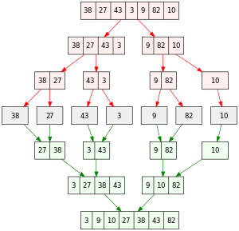

# 662 - Maximum Width of Binary Tree

<details>

<summary>Description 题目描述 </summary>

Given the `root` of a binary tree, return _the **maximum width** of the given tree_.

The **maximum width** of a tree is the maximum **width** among all levels.

The **width** of one level is defined as the length between the end-nodes (the leftmost and rightmost non-null nodes), where the null nodes between the end-nodes that would be present in a complete binary tree extending down to that level are also counted into the length calculation.

It is **guaranteed** that the answer will in the range of a **32-bit** signed integer.

```
           1
         /   \
        3     2
       / \     \  
      5   3     9 

Output: 4
Explanation: third level with the length 4 (5,3,null,9).
```

```
          1
         / \
        3   2
       /     \  
      5       9 
     /         \
    6           7
Output: 8
Explanation: fourth level with the length 8 (6,null,null,null,null,null,null,7)
```

<pre><code>          1
         / \
        3   2 
       /        
      5      
<strong>
</strong>Output: 2
Explanation: second level with the length 2 (3,2).
</code></pre>

```
          1
         /  
        3    
       / \       
      5   3     

Output: 2
Explanation: third level with the length 2 (5,3).
```

</details>

> The key to solve the problem though lie on <mark style="color:yellow;">**how we index the nodes that are on the same level.**</mark>  这个索引将按照complete binary tree的方式分配，即root的索引为0，left subtree的index为2_parentIndex，右子树的索引为2_parentIndex+1。

<figure><figcaption></figcaption></figure>

<details>

<summary>解题思路 Intuition </summary>

intuition: 用level order traversal, 形成每层的一个nested list&#x20;

</details>

<details>

<summary>Algorithm </summary>

<pre><code>我们按照完全二叉树的方式为每个节点分配索引。
根节点的索引为0，左子节点的索引为2parentIndex，右子节点的索引为2parentIndex+1。
所以，树的节点和其对应的索引如下：
    1(0)      [(1, 0)]
   /   \
 3(0)  2(1)   [(3, 0), (2, 1)]   -> 首部索引：0，尾部索引：1，宽度：1 - 0 + 1 = 2
 /
5(0)          [(5, 0)]   -> 首部索引：0，尾部索引：0，宽度：0 - 0 + 1 = 1
==========================================================================
    1(0)      [(1, 0)]
   /   \
 3(0)  2(1)   [(3, 0), (2, 1)]   -> <a data-footnote-ref href="#user-content-fn-1">索引</a>：0，尾部索引：1，宽度：1 - 0 + 1 = 2
 / \     \
5(0) 3(1) 9(3)  [(5, 0), (3, 1), (9, 3)]   -> 首部索引：0，尾部索引：3，宽度：3 - 0 + 1 = 4
</code></pre>

算法步骤：

1. <mark style="color:orange;">**Initialization**</mark>**:** \
   **-** Initialize 一个empty queue，enqueue  <mark style="color:blue;">**root.val及index**</mark> as a <mark style="color:yellow;">**PAIR**</mark>\
   **-** Initialize a variable <mark style="color:yellow;">**maxWidth**</mark> to record the maximum width.
2. <mark style="color:orange;">**Loop**</mark>: when the queue is not empty, process each level of the tree
   * <mark style="color:blue;">**Calculate Width**</mark>: Record the indices of the front and end nodes in the queue. \
     The width of this level is `endIndex - frontIndex + 1`.
   * <mark style="color:blue;">**Update Max Width**</mark>: If the calculated width is larger than `maxWidth`, update `maxWidth`.
   * <mark style="color:blue;">**Enqueue Children**</mark>: Traverse each node in the queue (i.e., all nodes at the current level), enqueue their children nodes with their corresponding indices. The index of the left child node is `2 * index`, and the index of the right child node is `2 * index + 1`.
3. 返回所有层中宽度最大的值。

</details>

<details>

<summary>Code Demo </summary>

```java
```

</details>

<details>

<summary>Code Analysis</summary>


</details>

<details>

<summary>心得 Key Points</summary>


</details>

[^1]: 
